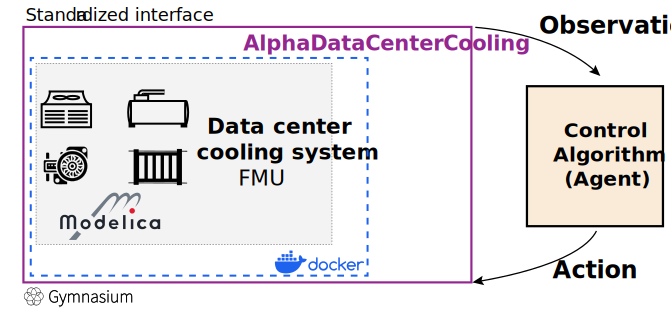

# AlphaDataCenterCooling: A virtual testbed for optimizing data center cooling system
Welcome to the official repository of AlphaDataCenterCooling, a framework designed for enhancing and optimizing data center cooling systems. 
This virtual testbed is split into two integral components:
1) **AlphaDataCenterCooling Docker Service**: Encapsulates the data center cooling system's simulation model. 
Operates within a Docker container for consistent, reproducible simulations.
2) **AlphaDataCenterCooling Gym Environment**: Located within the `AlphaDataCenterCooling_Gym` directory. It nterfaces with the Docker service, 
offering a standardized environment for applying and testing various control algorithms, specifically designed for optimizing data center cooling strategies.

## Overview



## Structure
- `/AlphaDataCenterCooling_Gym`: This folder contains the gym environment for the AlphaDataCenterCooling.
- `/Resources`: This folder contains models, boundary condition data, and other data required to load the model. 
This is crucial for the initialization and normal operation of the environment.
    - `AlphaDataCenterCooling_FMU.fmu`: This is a Functional Mock-up Unit (FMU) representing the cooling system model.
    - `Disturbance.csv`: Boundary condition data.
    - `Initialization_actions.csv` and `Initialization_observation0.csv`: Data used for initializing the environment.
    - `mlp.pth`: This is a Multilayer Perceptron (MLP) neural network model used for calculating the required head (pressure) 
    - `version.txt`: Indicates the current version of the AlphaDataCenterCooling environment.
- `/docs`: This directory contains documentation and figures related to the AlphaDataCenterCooling environment.
- `/testing`:  This directory includes notebooks for REST API interaction.
    - `test_REST_API.ipynb`: Demonstrates how to interact with the AlphaDataCenterCooling environment using the REST API.
    - `validate_Pumps_Power.ipynb`: Validates whether the results obtained using Matlab Simulink match those simulated using the PyFMI library. 
## Code Usage (Setting up the AlphaDataCenterCooling Docker Service)
1) Download and navigate to the repository:
```
git clone https://github.com/wfzheng/AlphaDataCenterCooling.git
cd AlphaDataCenterCooling
```
2) Install [Docker](https://docs.docker.com/get-docker/) and [Docker Compose](https://docs.docker.com/compose/install/).
3) To construct and initiate the AlphaDataCenter Service, execute the subsequent command within the `/AlphaDataCenterCooling` root directory:
```
docker-compose up
```
4) Validate the functionality of the AlphaDataCenter docker environment using the Jupyter notebook located at  `test/test_REST_API.ipynb`

# Feedback

Feel free to send any questions/feedback to: [Zhe Wang](mailto:cezhewang@ust.hk) 

# Citation

If you use our code, please cite us as follows: